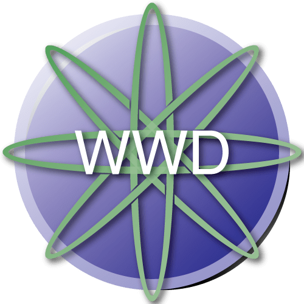
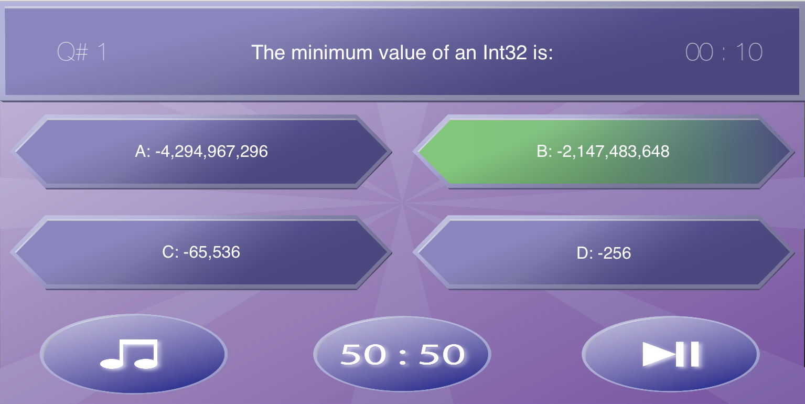

<h1 align="center">Who Wants to be a Developer</h1>

<table style="width:100%">
  <tr>
    <th>Main Menu</th>
    <th>Game Screen</th> 
    <th>Highscores</th>
  </tr>
  <tr>
    <td></td>
    <td></td> 
    <td></td>
  </tr>
</table>

## About the Playground
_"Who Wants to Be a Developer"_ is a fun playground, focused on learning. In this WWDC18 Scholarship Submission, you will be learning about any topic you choose by playing a variation of the popular _"Who Wants to Be a Millionaire"_ game format. The game style has been adapted to an arcade experience. Answer as many questions to set a new highscore. Every 10 rounds you will be equipped with the fifty-fifty-joker. The game comes bundled with questions about the programming language [Swift](https://developer.apple.com/library/content/documentation/Swift/Conceptual/Swift_Programming_Language/), but thanks to its modularity you can easily swap them out with your own. Simply create a new JSON file. 
> Learn more by running this project and reading the information provided on the main page (`Contents.swift`)

## License
You are free to use the contents of this project in any way you see fit (with exception to the sound files, as they have not been created by the author of this project).

The contents of this project are subject to multiple licenses depending on their format. The software and documentation is licensed by the MIT license, which is detailed in the file `LICENSE`. All graphics are licensed via the Creative Commons license, which is outlined in the file `LICENSE_GRAPHICS`. Sound files are created by external authors and therefore are bound to their original licenses that are detailed in the file `LICENSE_SOUNDS`. 
